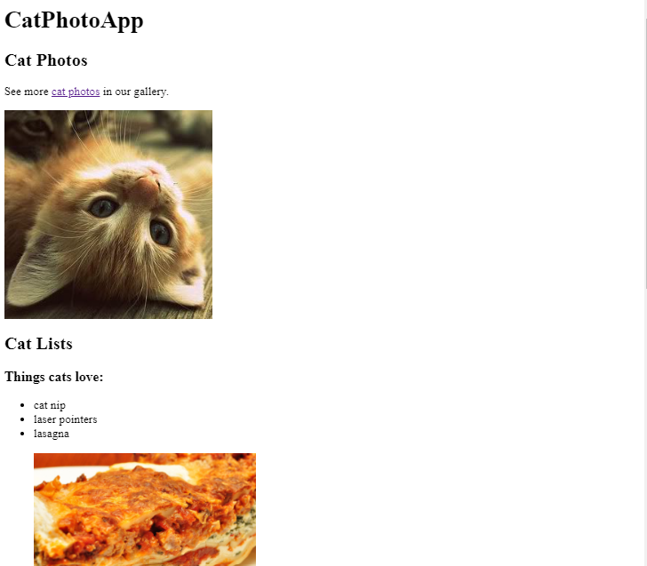
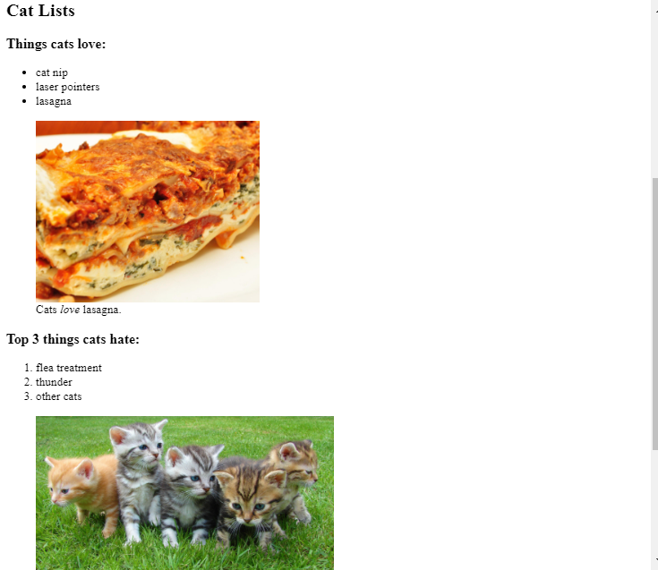
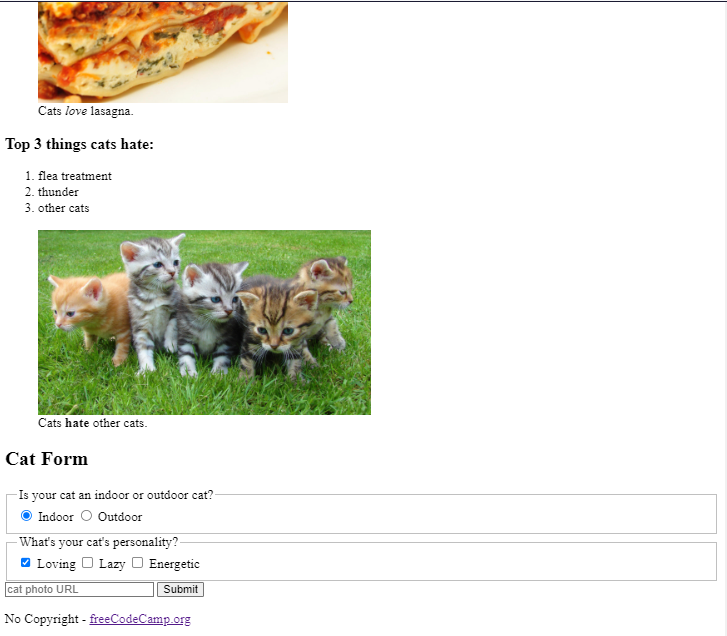
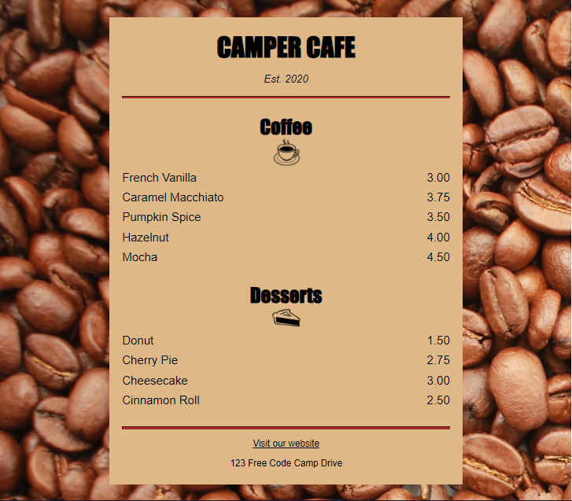

# Content 

# Responsive Web Design
- <a href="../FreeCodeCamp/CatSurveyForm/index.html"> Cat Photo App (HTML) </a>

  
  
  

HTML tags give a webpage its structure. You can use HTML tags to add photos, buttons, and other elements to your webpage.

In this course, I learnt the most common HTML tags by building your own cat photo app.

- <a href="../FreeCodeCamp/CafeMenu/index.html">Cafe menu (HTML)</a>

- <a href="../FreeCodeCamp/CafeMenu/styles.css">(CSS)</a>

  

CSS tells the browser how to display your webpage. You can use CSS to set the color, font, size, and other aspects of HTML elements.

In this course, I learnt CSS by designing a menu page for a cafe webpage.

- <a href="../FreeCodeCamp/ColorMakers/styles.css">Colored Markers </a>

  

Selecting the correct colors for your webpage can greatly improve the aesthetic appeal to your readers.

In this course, I built a set of colored markers. You'll learn different ways to set color values and how to pair colors with each other.

- Registration Forms
- Survey Form (Certification Project)
